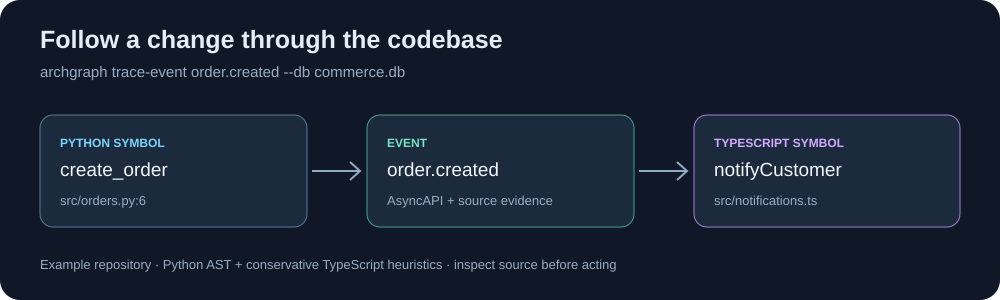

# ArchitectureGraph

[](https://github.com/Osirisdynasty/ArchitectureGraph/actions/workflows/tests.yml) [](LICENSE)

**Find the code behind a feature—and the likely blast radius of a change.** ArchitectureGraph builds a local, queryable architecture graph from Python and JavaScript/TypeScript repositories. Ask where an event starts and ends, which contracts a module exposes, or what a proposed change may touch. Results include source evidence and confidence rather than just a diagram.



The picture comes from the included [commerce example](examples/commerce). `create_order` publishes `order.created` at `src/orders.py:6`; `notifyCustomer` subscribes in `src/notifications.ts`. The TypeScript edge is heuristic, so review source before acting on it.

ArchitectureGraph works as a CLI or a Codex MCP plugin. The graph stays in a local SQLite file. No hosted service or account is required.

It is designed for agent workflows where a small, evidence-backed map of the codebase is more useful than a raw file search.

## What it can do

- Build a graph of modules, files, symbols, APIs, events, schemas, requirements, and tasks.
- Trace dependency, data, and event flows across indexed Python and JS/TS code.
- Read OpenAPI, AsyncAPI, GraphQL SDL, and Proto descriptions into the contract graph.
- Estimate symbol, contract, requirement, Git diff, and hypothetical-change impact.
- Expose the same analysis surface through both CLI commands and a JSON-RPC MCP server.

> This is an MVP. Python analysis uses the native AST; JavaScript/TypeScript analysis intentionally uses conservative heuristics until a Tree-sitter or TypeScript-service enricher is added.

## Try it in two minutes

Requires Python 3.10+ and Git. Clone this repository, then install it into an active Python environment. This project is not published on PyPI yet.

macOS/Linux:

```bash
git clone https://github.com/Osirisdynasty/ArchitectureGraph.git
cd ArchitectureGraph
python3 -m venv .venv
source .venv/bin/activate
python -m pip install -e .
archgraph index examples/commerce --db commerce.db
archgraph trace-event order.created --db commerce.db
```

Windows PowerShell:

```powershell
git clone https://github.com/Osirisdynasty/ArchitectureGraph.git
Set-Location ArchitectureGraph
python -m venv .venv
.\.venv\Scripts\Activate.ps1
python -m pip install -e .
archgraph index .\examples\commerce --db .\commerce.db
archgraph trace-event order.created --db .\commerce.db
```

Next, try `archgraph project-map --db commerce.db` or `archgraph requirement-impact "notify a customer when an order is placed" --db commerce.db`. See the [Click case study](docs/click-case-study.md) for a run against a real public repository.

## Use with Codex

The repository contains a Codex plugin manifest and `.mcp.json`. Install the Python package first in an environment whose `archgraph-mcp` executable is on the PATH used by Codex, then install the plugin from a local marketplace or configure its MCP server. The server name is `architecture-graph`. `archgraph-mcp` uses `ARCHGRAPH_DB` when set; otherwise it opens `architecture-graph.db` in its working directory. For a fixed database, launch `archgraph serve --db <path>` instead.

The plugin is **not** yet in a public Codex marketplace; cloning this repository alone does not activate it in Codex. The CLI quick start above works independently of Codex.

Use `archgraph --help` to see all commands and `python -m unittest discover -s tests -v` to run the test suite.

## Tool examples

```powershell
archgraph module-contract src.orders --db .\commerce.db
archgraph symbol-impact src.orders.create_order --db .\commerce.db
archgraph git-diff-impact --db .\commerce.db --repo .\examples\commerce --rev HEAD~1..HEAD
archgraph snapshot --db .\commerce.db --out before.json
archgraph index .\examples\commerce --db .\commerce.db
archgraph snapshot --db .\commerce.db --out after.json
archgraph graph-diff --before before.json --after after.json
archgraph verify-spec --db .\commerce.db --spec .\examples\commerce\spec.json
```

`graph-diff` compares two snapshots directly and does not require `--db`. `verify-spec` accepts `{"requirements":[{"id":"REQ-1","text":"...","must_touch":["module.name"]}]}` and is independently runnable: it checks that every declared `must_touch` module exists and that the indexed graph contains at least one fact matching a meaningful requirement term. It does not require a prior `requirement-impact` call. Contract source files supported by the built-in adapters are OpenAPI/AsyncAPI JSON, GraphQL SDL, and Proto. YAML API descriptions are reported as adapter candidates unless converted to JSON; installing a YAML-capable adapter is intentionally deferred.

## What is implemented

- SQLite node/edge persistence with edge evidence, provenance, confidence, and commit fields.
- Python AST indexer; dependency/call graph; lightweight read/write and event heuristics.
- JavaScript/TypeScript import/declaration/call/event fallback parser; optional TypeScript adapter seam.
- Contract adapter interfaces plus OpenAPI, AsyncAPI, GraphQL, and Proto MVP adapters.
- Requirement candidate mapping, hypothetical changes, snapshot comparison, Git diff and co-change enrichment.
- CLI, JSON-RPC MCP server, example repository, and unit tests.

## Known limitations

- JavaScript/TypeScript route-host versus HTTP-client receiver classification is lexical and heuristic: it depends on receiver names and assignments in the same file. The design chooses **may miss, must not misclassify** for ambiguous forms, so only direct relative named imports of an explicitly exported Router alias are treated as cross-file route hosts. Cross-file same-name collisions, renamed imports, re-export chains, dynamic construction, package aliases, and default/namespace imports are unreliable and may be missed. Precise handling requires Tree-sitter or a TypeScript type service, neither of which is implemented.

## Not yet implemented

- Full TypeScript compiler or Tree-sitter resolution, package alias resolution, and framework-specific routing.
- Precise interprocedural/control-flow/taint analysis; use a future Joern or CodeQL enricher.
- Runtime correlation; a future OpenTelemetry enricher can ingest traces with `provenance=runtime`.
- YAML parsing, semantic requirement extraction, auth-aware API discovery, and a visual graph UI.

See [DESIGN.md](DESIGN.md) for the four-layer model and extension architecture.

## License

[MIT](LICENSE). Contributions and reproducible bug reports are welcome via GitHub issues and pull requests.
